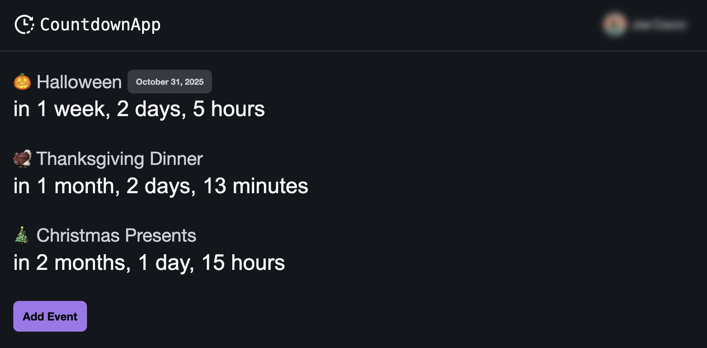

# CountdownApp

Countdown integrated with Google Calendar.

https://countdown.smallbytes.dev



## Features

- Integrates with Google Calendar so you don't need a separate app to manage countdowns. You can add already existing events!
- Display countdown in total days or detailed break down.
- Change what keyword identifies events as a countdown.

## Contributing

Read the [contributing docs](/docs/CONTRIBUTING.md).

```bash
# start application dev server
npm start countdown

# start storybook dev server
npm run sb:start countdown
```

## Deploy

Auto deployed via Netlify ([config](./netlify.toml))
